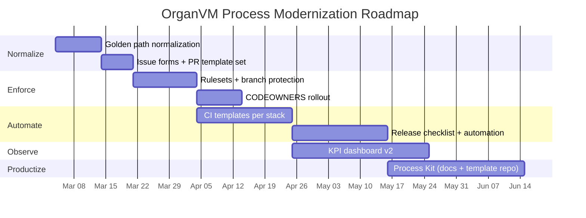
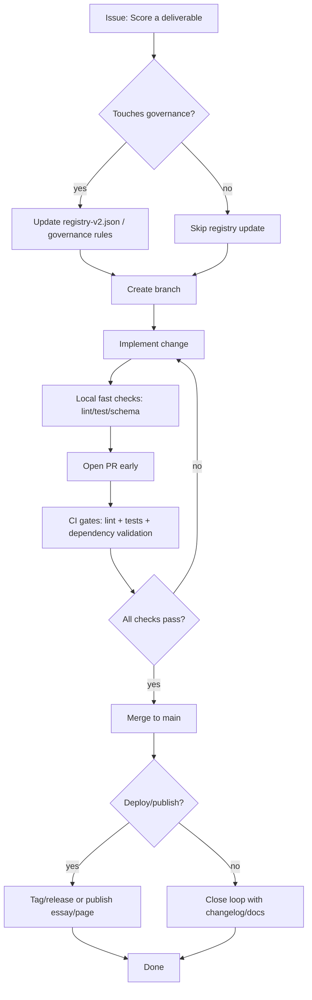

# Deep research report on disciplining, commodifying, and demystifying software process for an AI-conductor in the meta-organvm eight-organ system

## Executive summary

Your meta-organvm ecosystem already contains an unusually rich “process-as-product” substrate: a **governance corpus** that explicitly frames the system as operational, documentation-first, and automation-enforced; a **validated registry schema** describing repository metadata and dependency constraints; and multiple **CI workflows** and orchestration automations (audits, dependency validation, soak tests, dashboards). The organvm-corpvs-testamentvm repository explicitly describes itself as the authoritative planning/governance corpus for a launched eight-organ system, with documented milestones and an audit/automation footprint. citeturn9view0turn31view0turn13view1turn12view3

The practical gap is therefore not “absence of process,” but **translation**: turning the existing organvm governance model into **canonical SDLC-shaped primitives** (requirements → design → implementation → testing → deployment → maintenance), **minimal playbooks** that feel natural to an AI-conductor, and **repeatable packaged assets** (templates + automations + onboarding) that reduce effort instead of increasing it. The strongest leverage points are:

- **Standardize and simplify the “golden path”** across repos: one branching model, one PR/issue grammar, one CI naming scheme, one release checklist, and one minimum test matrix per repo tier (flagship/standard/stub/infrastructure). Your own standards already define tiered README depth, required root/community files, and governance constraints; the next move is to compress these into a 10–15 minute repeatable ritual. citeturn19view0turn32view0turn31view0  
- **Strengthen automated enforcement where it reduces cognition**: use organization-wide rulesets/branch protection and required status checks, plus structured issue forms and CODEOWNERS for path-based review. This turns “discipline” into default behavior. citeturn22search4turn22search0turn22search1turn22search2turn22search3  
- **Adopt a lightweight hybrid methodology**: *Kanban flow* for multi-repo orchestration + *Scrum-like timeboxes* only where you need cadence (shipping products), under a DevOps/CI/CD backbone and (selectively) SRE reliability practices for deployed surfaces. This precisely matches your “orchestra” metaphor: continuous rehearsal with occasional performances. citeturn21search10turn21search1turn25search0turn23search2turn23search3turn21search11  
- **Productize the process** by extracting and repackaging what you already have (seed contracts, schema-driven governance, documentation-first workflows) into a public “kit”: templates, tutorials, a starter repo, and optional paid layers (workshops, consulting, hosted dashboards). Your corpus already treats governance artifacts and documentation as portfolio assets. citeturn20view2turn9view0turn31view0turn8view3  

## Repository and README artifact audit

### What exists today in meta-organvm

The meta-organvm umbrella includes several repositories that together function as “process infrastructure” and “system nervous system,” not just application code:

- **organvm-corpvs-testamentvm**: explicitly described as the authoritative planning/governance corpus (not a code repo), with quick navigation to core artifacts like `registry-v2.json`, orchestration documents, and a historical and post-launch sprint log. It states a concrete launch date and system-wide metrics narrative. citeturn9view0turn17view0turn31view0  
- **organvm-engine**: a Python package providing registry/governance/seed/metrics/dispatch modules and a CLI that directly manipulates/validates system governance artifacts. citeturn8view0turn3view0  
- **schema-definitions**: canonical JSON Schema artifacts for registry, seed contracts, governance rules, dispatch payloads, soak tests, metrics, with validation scripts and CI. citeturn8view1turn12view0  
- **system-dashboard**: a FastAPI-based dashboard that reads corpus data and exposes health/registry/graph/soak/essays/omega pages plus JSON endpoints; includes CI. citeturn8view2turn12view1  
- **alchemia-ingestvm**: an ingestion engine and “aesthetic nervous system” (taste → organ aesthetics → repo overrides) to route creative material and enforce aesthetic DNA across AI-generated outputs; includes lint/test CI. citeturn8view3turn12view2  
- **.github**: org-level health files and an internal action (`actions/system-check`) plus `seed.yaml` contracts and agent context artifacts. citeturn2view0turn7view2turn7view1  

### Strengths (already aligned to modern best practice)

You already have several “canonical discipline” components that many teams struggle to institutionalize:

- **Schema-driven governance**: `registry-v2.json` is explicitly a single source of truth with enumerated schema notes (implementation status enum, revenue model split, CI workflow naming, required fields like dependencies/promotion_status/tier/last_validated). citeturn31view0turn8view1  
- **Automated dependency validation**: a GitHub Actions workflow validates back-edges, cycles, and transitive depth using registry + governance rules, and comments results on PRs. citeturn12view3turn32view0  
- **Audit and observability mindset**: monthly audits create issues and append audit history; soak-test daily snapshots are committed for longitudinal tracking; a weekly system pulse generates reports and can trigger distribution. citeturn13view1turn13view2turn13view3  
- **Repository standards defined**: you have explicit cross-cutting standards for root hygiene, tiered README depth, `.github/` health files, and badge conventions. citeturn19view0turn6view1  
- **Specification-driven development adapted to your corpus**: the SDD doc formalizes “specification as truth” and human review against measurable gates, explicitly keyed to your AI-conductor workflow. citeturn20view0turn32view0  

### Gaps and friction points (where “discipline” still costs effort)

These are practical, repo-observable friction points that increase cognitive load:

- **Source-of-truth drift risk** between orchestration hub and corpvs: the orchestration repo’s `registry.json` is now a redirect to `organvm-corpvs-testamentvm/registry-v2.json`, indicating consolidation. Meanwhile, at least one workflow example fetches registry artifacts from orchestration-start-here and contains fallback logic. This is survivable, but it is a classic “two places to look” tax unless aggressively standardized. citeturn29view0turn12view3turn31view0  
- **Naming uniformity**: your registry schema note enumerates CI workflow names (`ci-python.yml|ci-typescript.yml|...`), but the audited repos here use `ci.yml`. Even if that’s intentional, it undermines machine-verifiable consistency unless the registry and templates agree. citeturn31view0turn16view0turn12view2  
- **Template minimalism**: organvm-engine’s PR template exists and is lightweight, but does not yet encode your unique governance gates (registry updates, dependency compliance, promotion state constraints). That means humans must remember the “system rules” at PR time. citeturn16view1turn32view0turn19view0  
- **Artifact noise**: organvm-engine’s README contains “webhook test” lines, which are minor but signal “unpolished surface” to external evaluators. citeturn8view0  
- **Role clarity at the repo boundary**: your ecosystem has clear *organ-level mandates*, but canonical SDLC roles (product owner, architect, maintainer, SRE owner) are not consistently encoded in repo metadata (CODEOWNERS, labels, issue triage defaults). This is the difference between “a system the founder remembers” vs “a system that runs itself.” citeturn19view0turn22search3turn32view0  

## Mapping your system to SDLC phases and roles

### SDLC phase mapping (requirements → maintenance)

A canonical SDLC requires phase boundaries and artifacts. You already have artifacts; the practical move is to **rename and wire them** so that anyone (including future collaborators) can follow them as a default.

| SDLC phase | Canonical intent | organvm-aligned artifacts in your ecosystem | Where it shows up in meta-organvm | Minimal “done” signal |
|---|---|---|---|---|
| Requirements | define what/why, constraints, success | SDD specs (“specification as truth”), README scoring rubric references, governance constraints, registry fields describing purpose/status/tier | `11-specification-driven-development.md`, `registry-v2.json` schema notes, governance articles/thresholds | spec + issue exists; acceptance criteria measurable citeturn20view0turn31view0turn32view0 |
| Design | decide how, interfaces, dependencies | JSON Schema contracts, dependency rules/graph, system architecture docs | `schema-definitions`, governance rules, dependency validation workflows, system-dashboard graphs | schema validates; dependency graph legal; ADR or design note exists citeturn8view1turn12view3turn8view2turn32view0 |
| Implementation | build the thing | Python packages (`organvm-engine`, `alchemia`, `dashboard`), CLI commands, scripts | `src/`, CLI usage docs, ingestion pipeline modules | feature branch merged; code compiles/runs; docs updated citeturn8view0turn8view3turn8view2 |
| Testing | prove it works, prevent regressions | pytest suites, ruff/pyright, schema validation scripts, CI matrices | per-repo `ci.yml` workflows; schema `validate.py`; lint gates | CI green; minimum coverage or test count threshold met citeturn16view0turn12view2turn12view0 |
| Deployment | ship to users/environments | GitHub Actions workflows, dashboard deployment (local run indicated), POSSE publication workflows in corpus | corpvs workflows (pages deploy, essay deploy), system-dashboard quick start | release artifact exists (tag/package/page) and rollback path defined citeturn13view3turn8view2turn9view0 |
| Maintenance | operate, audit, evolve safely | monthly audits, soak tests, stale detector, governance enforcement | monthly-organ-audit, soak-test-daily, system pulse | alert thresholds respected; toil minimized; audit history updated citeturn13view1turn13view2turn32view0 |

### Role mapping (canonical roles → orchestral/AI-conductor roles)

Your “eight organs” are already a role system. The method becomes canonical when responsibilities are explicit at the repo boundary (owners, review paths, release authority).

| Canonical SDLC role | “Orchestra” metaphor | Practical responsibility | Where to encode it |
|---|---|---|---|
| Product owner | Composer | chooses outcomes, acceptance criteria, prioritization | issue forms; labels; milestone goals citeturn22search2turn21search0 |
| Architect | Principal / arranger | boundaries, schemas, dependency direction | schema-definitions; governance rules; ADRs citeturn8view1turn32view0turn24search3 |
| Tech lead / EM | Conductor | tempo, gates, merge/release authority | CODEOWNERS + rulesets; PR templates; branch protection citeturn22search3turn22search4turn22search1 |
| Developer | Section player | implements increments; writes tests | repo CI; test matrix; commit discipline citeturn16view0turn23search2 |
| QA | Rehearsal director | defines “Definition of Done,” test coverage | CI required checks; test plans; release checklist citeturn22search0turn21search1 |
| DevOps | Stage crew | automation pipeline, build/test/deploy | GitHub Actions workflows; reusable actions | citeturn25search3turn12view3 |
| SRE (for deployed) | Safety officer | SLOs, error budgets, incident practice | runbooks; SLO docs; postmortems | citeturn21search11turn21search3 |
| Technical writer | Program note author | public docs; onboarding; tutorials | Organ V outputs; README/Docs standards | citeturn19view0turn9view0 |

The key is that an AI-conductor can *play multiple roles*, but the system must still **emit role signals** (who approves, what gates apply) so discipline is automated.

## Methodology landscape and what fits your AI-conductor metaphor

### What “canonical methodologies” provide (and what they cost)

Below is a comparison oriented toward *lightweight adoption* and *metaphor fit*.

| Methodology | Primary promise | Heavyweight failure mode | What fits an AI-conductor/orchestra | Minimal adoption pattern | Primary sources |
|---|---|---|---|---|---|
| Waterfall | predictability via sequential phases | slow feedback; late discovery of wrong requirements | good for *corpus writing* and grant deliverables: a “score” that must be complete before performance | use only for “fixed deliverables” (grant app, spec, compliance) | Royce’s 1970 process paper is the historical anchor. citeturn24search0 |
| Agile | continuous delivery of value, adapt to change | “agile in words, waterfall in practice” | aligns with iterative rehearsal and reflection; favors interaction and adaptation | 1–2 week iteration; retrospectives; measure progress by shipped increments | Agile Manifesto & principles. citeturn21search4turn21search0 |
| Scrum | timeboxed sprints with defined roles/events | ceremony overload; role confusion | works when you need rhythm (shipping products) but can become theater | use “Scrum-lite”: sprint goal + planning + review/retro only | Scrum Guide. citeturn21search1 |
| Kanban | optimize flow; visualize work and limit WIP | infinite work-in-progress; no finishing | *best fit* for multi-repo orchestration: “rehearsal board” showing flow | one board per organ + system-level board; WIP limits; cycle time metrics | Kanban method guide + Kanban/Scrum guide. citeturn21search10turn21search14 |
| DevOps | integrate dev+ops to ship reliably and fast | tool-shopping without cultural change | your ORGAN-IV already embodies “stage crew + automation” | codify CI/CD, IaC where needed; eliminate manual toil | DevOps definitions + GitHub Actions as CI/CD substrate. citeturn25search0turn25search3 |
| DDD | align code with domain via bounded contexts + ubiquitous language | over-modeling; “DDD cosplay” | strong fit to your organ model: each organ resembles a bounded context with its own language | use *strategic DDD only*: define contexts, language, contracts (schemas) | Evans’ DDD reference + DDD overview. citeturn24search3turn24search19 |
| CI/CD | fast feedback; deployable at any time | slow pipelines; flaky tests; false confidence | CI as “daily rehearsal”; CD as “ready to perform anytime” | define 1 CI template per stack; require checks; keep pipeline under ~10 min | CI/CD definitions. citeturn23search2turn23search3turn25search3 |
| SRE | reliability via SLOs, error budgets, toil reduction | overkill for non-deployed repos | apply selectively to ORGAN-III and any public-facing services; “safety budget” for performances | define SLOs only for deployed services; adopt blameless postmortems | Google SRE on error budgets. citeturn21search11turn21search3 |

### Recommended hybrid for your system

Given your actual artifact base (registry + governance rules + audits + CI), the most coherent canonical “stack” is:

- **Kanban for system-wide flow** (multi-repo work visibility and WIP control). citeturn21search10  
- **Scrum-lite only where cadence matters** (shipping a product, running a cohort, publishing on schedule). citeturn21search1turn21search0  
- **DevOps + CI/CD as mandatory substrate** for code repos; treat automation as the default stage crew. citeturn25search0turn25search3turn23search2turn23search3  
- **Strategic DDD** as a vocabulary tool: organs as bounded contexts; `schema-definitions` as “published language.” citeturn24search3turn8view1  
- **Selective SRE** for deployed services: define SLOs and error budgets only where you can actually measure reliability and where downtime matters. citeturn21search11turn21search7  
- **DORA metrics** for delivery performance where deployments exist; otherwise adapt “DORA-like” throughput/stability metrics to documentation and governance outputs. citeturn23search0  

## Minimal playbooks, templates, and pipelines tailored to an eight-organ rhetorical/AI workflow

### The core idea: convert “discipline” into a 3-ritual loop

Borrowing your own SDD “specification power inversion,” the lightweight playbook is:

1) **Score** (specify): a short, structured intent with acceptance criteria  
2) **Rehearse** (implement + verify): small changes + CI feedback  
3) **Perform** (release/publish): visible artifact + postmortem/notes  

This is coherent with your governance gates (registry/portfolio/dependency/completeness). citeturn20view0turn32view0turn19view0  

### Minimal, repeatable playbook (sample)

```markdown
# Lightweight Playbook: Score → Rehearse → Perform (OrganVM Edition)

## Preconditions (2 minutes)
- [ ] Work has an Issue (or a tracked note in the corpus) with a single sentence "why".
- [ ] Pick the organ scope: I / II / III / IV / V / VI / VII / Meta.
- [ ] If this changes repo relationships or state: update registry-v2.json fields (dependencies, tier, promotion_status, last_validated).

## Score (5–10 minutes)
Write a micro-spec in the Issue description:

**Outcome:** what changes for a user/reader/system.
**Non-goals:** what you will not do now.
**Acceptance checks (3–7):** measurable checks (tests pass, schema validates, link check, etc.)
**Risk:** one sentence.
**Roll-back:** how to undo or revert.

## Rehearse (15–120 minutes, depending)
- [ ] Create branch: organ/<organ-id>/<short-slug>  (or feature/<slug>)
- [ ] Keep the change small (aim: 1 PR = 1 idea).
- [ ] Run the fastest local checks:
  - lint/format
  - unit tests
  - schema validation (if touching registry/seed/governance)
- [ ] Open PR early as a "rehearsal PR" if you want CI feedback while iterating.

## Perform (5–20 minutes)
- [ ] PR merges only when required checks pass and the PR checklist is complete.
- [ ] If deployed/published: tag + release notes (or publish essay/page).
- [ ] Update CHANGELOG minimally ("Added/Changed/Fixed").
- [ ] If the change caused a regression: write a 5-sentence postmortem (what happened, why, fix, prevention, follow-up).

## Done signals
- Registry updated where relevant.
- CI green.
- One visible artifact shipped (release, page, or documented spec).
```

This playbook explicitly minimizes ceremony while preserving canonical SDLC intent: requirements (micro-spec), design (acceptance criteria + constraints), implementation/testing (CI), deployment/maintenance (release + postmortem).

### Branching strategy for solo, small team, and org contexts

A single strategy should work across all sizes by restricting variance.

**Recommended default: trunk-based with short-lived branches**
- Default branch: `main`
- Branch naming: `organ/<ORGAN-ID>/<slug>` or `feat/<slug>` and `fix/<slug>`
- Merge method: squash-merge (one PR → one commit on main)
- Release tags: `vX.Y.Z` only for code/packages; docs-only repos can use dated releases or none

Why this fits: trunk-based development complements CI and reduces merge pain; CI exists across repos already. citeturn23search2turn22search0turn16view0  

### Sample issue templates (tailored)

You already have markdown templates (bug/feature) in organvm-engine. citeturn16view2turn16view3  
Below are *organvm-specific* lightweight versions that encode your governance gates.

#### Sample issue form (YAML) — “Deliverable score”

```yaml
name: "Score a Deliverable (micro-spec)"
description: "Create a small, testable spec that an AI-conductor can execute."
title: "[SCORE] "
labels: ["score", "needs-triage"]
body:
  - type: dropdown
    id: organ
    attributes:
      label: "Organ"
      options:
        - "ORGAN-I (Theory)"
        - "ORGAN-II (Art)"
        - "ORGAN-III (Commerce)"
        - "ORGAN-IV (Orchestration)"
        - "ORGAN-V (Public Process)"
        - "ORGAN-VI (Community)"
        - "ORGAN-VII (Marketing)"
        - "Meta"
    validations:
      required: true

  - type: textarea
    id: outcome
    attributes:
      label: "Outcome"
      description: "What changes in the world when this is done?"
      placeholder: "Example: A new CI gate prevents invalid dependency back-edges from merging."
    validations:
      required: true

  - type: textarea
    id: acceptance
    attributes:
      label: "Acceptance checks (3–7)"
      description: "Make them measurable. These are your rehearsal criteria."
      placeholder: |
        - CI green on main
        - Schema validation passes
        - New test added for edge case X
        - README updated (if user-facing)
    validations:
      required: true

  - type: checkboxes
    id: governance
    attributes:
      label: "Governance gates"
      options:
        - label: "Registry updated if repo state/relationships changed"
        - label: "Dependency direction respected (no back-edges/cycles)"
        - label: "Completeness: no TBDs, no broken links (if docs)"
        - label: "Portfolio: public-facing clarity improved (if applicable)"
```

This leverages GitHub issue forms syntax and encourages structured issues. citeturn22search2  

#### Sample PR template (system-aware)

You already have a minimal PR template; this is a tightened version that encodes your four quality gates. citeturn16view1turn32view0  

```markdown
## Summary (1–3 sentences)

## What changed
- 

## Why (link to Issue / Score)
- Closes #

## Checks (Definition of Done)
- [ ] Tests pass locally (or not applicable)
- [ ] CI passes
- [ ] Lint/format passes
- [ ] Docs updated where needed

## Governance gates (OrganVM)
- [ ] Registry updated (if repo status/tier/deps/promotion changed)
- [ ] Dependency rules satisfied (no back-edges, no cycles, depth <= max)
- [ ] Completeness gate: no TODO/TBD placeholders in shipped artifacts
- [ ] If user-facing: passes the Stranger Test (quick clarity)

## Risk & rollback
Risk:
Rollback:
```

### Testing matrix (minimal, tier-based)

Use the tier field you already maintain in `registry-v2.json` (flagship/standard/stub/infrastructure) as the driver for test expectations. citeturn31view0turn19view0  

| Repo tier | Minimum tests | CI expectation | Suggested fast checks |
|---|---|---|---|
| Flagship | unit + contract tests; basic integration where relevant | matrix (2 runtimes) + lint + typecheck | lint, format, typecheck, unit tests, schema checks |
| Standard | unit tests covering main paths | single runtime + lint | lint + unit tests |
| Stub | smoke test only (or schema-only if docs) | minimal CI to prevent broken merges | markdown lint / link check |
| Infrastructure | contract validation + smoke | minimal but strict | schema validation, link check |

### Sample CI workflow YAML (generic “small but disciplined”)

You already run CI via GitHub Actions. citeturn25search3turn16view0turn12view2  
Below is a *single template* that can serve most Python repos, with room for extension.

```yaml
name: ci

on:
  push:
    branches: [ "main" ]
  pull_request:
    branches: [ "main" ]

jobs:
  test:
    runs-on: ubuntu-latest
    strategy:
      fail-fast: false
      matrix:
        python-version: ["3.11", "3.12"]

    steps:
      - uses: actions/checkout@v4

      - name: Set up Python
        uses: actions/setup-python@v5
        with:
          python-version: ${{ matrix.python-version }}

      - name: Install
        run: |
          python -m pip install --upgrade pip
          pip install -e ".[dev]"

      - name: Lint (fast)
        run: |
          ruff check src/ tests/
          ruff format --check src/ tests/

      - name: Typecheck (fast)
        run: |
          pyright src/

      - name: Tests
        run: |
          pytest -q

  governance-contracts:
    # Runs only if governance artifacts change
    if: ${{ github.event_name == 'pull_request' }}
    runs-on: ubuntu-latest
    steps:
      - uses: actions/checkout@v4
      - name: Validate contracts (schemas/registry/seed)
        run: |
          # Example: validate seed.yaml or registry files when present
          # python scripts/validate.py --all-examples
          echo "Add schema validation here when relevant."
```

### Release checklist (minimal)

This solves the “I can build endlessly but I don’t ship” problem without adding overhead.

**For code repos (packages/services)**
- version bump policy (SemVer or date-based)
- changelog entry
- tag + release notes
- smoke test in CI
- rollback note

**For docs/process repos**
- publish artifact (Pages / essay / PDF)
- run link check
- update registry/timestamps
- announce via Organ VII distribution (if applicable)

Your workflows already automate publication/distribution in parts of the corpus; formalizing the checklist makes behavior repeatable. citeturn13view3turn13view1turn9view0  

## Metrics, KPIs, and automated enforcement

### What to measure: discipline *and* outcomes

A rhetorician/AI-conductor often benefits from metrics that measure **flow and friction** rather than raw output.

#### Delivery performance (where deployment exists)

Use DORA metrics where you have deployments; they measure throughput and instability (lead time, deployment frequency, recovery time, change fail rate). citeturn23search0  

Practical mapping:
- **Lead time**: PR opened → merged → deployed (or published)
- **Deployment frequency**: releases per week
- **Failed deployment recovery time**: time from incident to restore
- **Change fail rate**: % releases requiring hotfix/rollback

#### Flow metrics (works even for docs/non-deployed)

- Cycle time per PR (open → merge)
- WIP count (open PRs + in-progress issues)
- Review latency (time to first review)
- “Rework rate” (PRs reopened / CI failed repeatedly)

These align with Kanban flow thinking. citeturn21search14turn21search10  

#### Governance and quality metrics (unique to your system)

Your governance rules already define measurable thresholds: max transitive depth, no circular deps, no back-edges, stale repo days, missing changelog/CI/badges; plus per-organ requirements (e.g., Organ V minimum essays). citeturn32view0turn13view1turn13view2  

Suggested KPI set (system-level):
- **Governance compliance rate** = repos passing dependency validation / total repos
- **Audit criticals** = number of critical alerts from monthly audit
- **CI coverage** = repos with CI workflow / total repos (you already track this conceptually) citeturn13view1turn31view0  
- **Documentation completeness** = repos with documentation_status DEPLOYED / total
- **Staleness** = repos untouched > 90 days (warning threshold exists)
- **Promotion throughput** = promotions executed per month by path (I→II, II→III, ANY→V)

For rhetorical/AI workflow outcomes:
- **Spec-to-merge ratio**: % of PRs linked to a “Score” issue
- **AI draft efficiency**: (draft iterations) before merge (proxy via commit count in PR)
- **Stranger Test proxy**: README/Docs lint score or checklist completion (your standards already define measurable README depth by tier). citeturn19view0turn20view0  

### Automated enforcement: turn discipline into defaults

#### Repository rulesets + branch protection

Use rulesets/branch protection to enforce:
- required status checks before merge
- required reviews (and optionally code owner review)
- consistent commit metadata
- prevention of direct pushes to main

GitHub explicitly supports rulesets and required status checks as merge gates. citeturn22search4turn22search0turn22search1turn22search5  

#### CODEOWNERS for organ-aware review

A CODEOWNERS file can define responsibility by path; combined with branch protection (“require review from code owners”), you get role clarity without meetings. citeturn22search3turn22search1  

Example CODEOWNERS strategy:
- `registry-v2.json` → ORGAN-IV owner(s)
- `.github/workflows/*` → ORGAN-IV stage crew
- `docs/*` → ORGAN-V public process
- `src/*` → repo maintainer

#### Issue forms for structured intake

Issue forms create consistent, machine-readable problem statements and acceptance criteria. citeturn22search2turn22search6  

#### CI gates (fast by default)

Keep a strict rule: “if it’s slow, it’s optional.” The point is *fast feedback* (CI) more than “perfect coverage.” CI is defined as frequent integration verified by automated builds/tests. citeturn23search2turn25search3  

### KPI dashboard mockup suggestion

You already have system-dashboard and weekly pulse generation. citeturn8view2turn13view3  
A KPI dashboard mockup could look like:

```text
┌─────────────────────────────────────────────────────────────┐
│ OrganVM System Dashboard                                     │
├───────────────────────────────┬─────────────────────────────┤
│ Governance                    │ Delivery (deployable repos)  │
│ - Back-edge violations: 0     │ - Lead time (p50): 1.2 days  │
│ - Circular deps: 0            │ - Deploy freq: 3 / week      │
│ - Max transitive depth (p95): │ - Change fail rate: 6%       │
│   3 (limit 4)                 │ - Recovery time: 45 min      │
├───────────────────────────────┼─────────────────────────────┤
│ Documentation                 │ Flow                          │
│ - DEPLOYED repos: 73 / 101    │ - PR cycle time (p50): 0.8 d  │
│ - Flagships: 7                │ - WIP (open PRs): 4          │
│ - Broken links: 2 warnings    │ - Review latency (p50): 6 hr │
├───────────────────────────────┼─────────────────────────────┤
│ Reliability (deployed only)   │ Community & Distribution     │
│ - SLO: 99.9% (30d)            │ - Essays published (30d): 4  │
│ - Error budget remaining: 62% │ - Distributions sent: 8      │
└─────────────────────────────────────────────────────────────┘
```

## Commodifying and demystifying the process

### Package what you already have into a product surface

Your ecosystem already contains multiple “sellable primitives”:

- **Seed contracts (`seed.yaml`)** as an automation interface (agents, triggers, produced artifacts). citeturn32view1turn7view2  
- **Schema definitions** as portable “data contracts for process.” citeturn8view1turn12view0  
- **Aesthetic nervous system** as a differentiator for AI-mediated creative production (a rare integration of style governance + content routing). citeturn8view3  
- **Documentation-first + governance-first** framing explicitly described as portfolio value. citeturn20view2turn9view0turn31view0  

Turn these into a commodified offering by separating:

1) **Open core** (templates + docs + starter repo)  
2) **Paid accelerators** (workshops, setup service, hosted dashboards, private community)

### Recommended packaging set

A practical “process kit” that can be installed in any org:

- **Template repository** (“OrganVM Process Kit”) containing:
  - `.github/` issue forms and PR templates (system-aware)
  - CI templates for Python/TypeScript/mixed/minimal (matching your registry’s `ci_workflow` enumerations) citeturn31view0turn32view0  
  - release checklist templates
  - CODEOWNERS patterns
  - a 2-page “Score → Rehearse → Perform” playbook
- **Docs site** (MkDocs/Docusaurus or GitHub Pages) with:
  - “solo / 2–5 / 10+” operating modes
  - onboarding flow: 30 minutes to first PR merged
  - tutorials: adding a repo, adding a dependency, publishing an essay, promoting an artifact
- **Optional commercial layer**
  - paid “setup audit + installation” (one-time)
  - paid “process coaching” (monthly)
  - hosted dashboard (SaaS) that reads registries and GitHub APIs and emits weekly reports

### Monetization models that fit the ecosystem

- **Templates + licensing**: open templates, paid “pro” templates (industry variants: research lab, art institution, SaaS bootstrapper)
- **Workshops**: “AI-Conductor SDLC for Solo Builders,” “Governance as Product,” “Schema-driven orchestration”
- **Consulting**: install and customize the method for small teams
- **Sponsorship**: if the public narrative is strong, sponsorship can fund continued tooling

This aligns with the idea that protocols/governance can be primary output (your orchestration docs explicitly frame governance artifacts as portfolio assets). citeturn20view2turn31view0  

## Prioritized roadmap with milestones, effort, and risks

The roadmap is arranged to maximize “better results with less effort” by front-loading automation and reducing decision fatigue.

| Milestone | What you ship | Effort | Primary risk | Risk control |
|---|---|---|---|---|
| Golden path normalization | one canonical CI naming scheme; one PR template; one issue form set; removal of artifact noise | Low | breaking existing automation assumptions | do changes behind compatibility layer; update registry schema note + templates together citeturn31view0turn16view0turn19view0 |
| Org-wide enforcement | rulesets/branch protection + required checks + CODEOWNERS in critical repos | Medium | contributor friction; “blocked merges” surprises | start with 1–2 flagship repos; publish policy in CONTRIBUTING citeturn22search4turn22search0turn22search3turn6view1 |
| System-aware issue intake | replace markdown-only issue templates with issue forms for “Score / Bug / Governance change” | Low | form schema churn | keep minimal fields; version templates; rely on GitHub docs citeturn22search2turn22search6 |
| CI templates per stack | publish and adopt `ci-python.yml`, `ci-typescript.yml`, `ci-minimal.yml` to match registry enumerations | Medium | partial adoption across 100+ repos | gradual adoption via tiering: flagships first; standards next citeturn31view0turn12view2 |
| Release discipline | release checklist + automation (tagging, changelog enforcement) for deployable repos | Medium | overkill for non-deployed repos | apply only to deployment-bearing repos (Organ III + services) citeturn23search3turn23search0 |
| KPI dashboard v2 | extend system-dashboard to show governance + flow + DORA-like metrics | High | data collection complexity across orgs | start with what registry already has; add GitHub API later citeturn8view2turn31view0turn13view1 |
| Productization launch | public “Process Kit”: repo template + docs + onboarding tutorial + examples | High | scope creep; narrative dilution | freeze v1 scope (one kit, one tutorial path); iterate based on adoption citeturn19view0turn20view0turn9view0 |

### Timeline visualization suggestion (Gantt-style, mermaid)



## Suggested process visualizations

### Proposed process flowchart (mermaid)



This explicitly encodes your “score/rehearse/perform” loop while preserving SDLC meaning and governance gates. citeturn20view0turn32view0turn23search2  

## Tool recommendations (OSS and commercial) by function

This table favors “minimum viable discipline” and avoids tool sprawl.

| Function | OSS default | Commercial default | Why it fits |
|---|---|---|---|
| Work tracking | GitHub Issues + Projects | Jira (entity["company","Atlassian","software company"]) | You already encode governance in GitHub-native artifacts; adding external PM tools is optional. citeturn22search2 |
| CI/CD | GitHub Actions | GitHub Actions + hosted runners | Native CI/CD platform; you already use it widely. citeturn25search3turn12view2 |
| Code quality | ruff/pyright/pytest (Python) | SonarQube / Snyk | Your repos already use ruff/pyright/pytest patterns. citeturn16view0turn12view2 |
| Dependency updates | Renovate | Dependabot | Automates “maintenance toil”; use with strict rulesets. citeturn22search4turn22search0 |
| Documentation site | GitHub Pages | GitBook | You already publish via Pages in the ecosystem narrative. citeturn9view0turn13view3 |
| Observability | Prometheus + Grafana | Datadog | Only needed for deployed services; otherwise your audit/soak model is the lightweight alternative. citeturn13view2turn21search11 |

## Primary/official sources (link list)

(Links are provided as references via citations throughout. Key anchors include: Agile Manifesto citeturn21search4, Scrum Guide citeturn21search1, Kanban guide citeturn21search10, DevOps definition citeturn25search0, CI citeturn23search2, Continuous Delivery citeturn23search3, DORA metrics citeturn23search0, Google SRE error budgets citeturn21search11, DDD reference by entity["people","Eric Evans","domain-driven design author"] citeturn24search3, GitHub rulesets/branch protection/issue forms/CODEOWNERS citeturn22search4turn22search1turn22search2turn22search3, and your own organvm corpus/artifacts citeturn31view0turn32view0turn19view0turn20view0turn9view0turn8view3.)